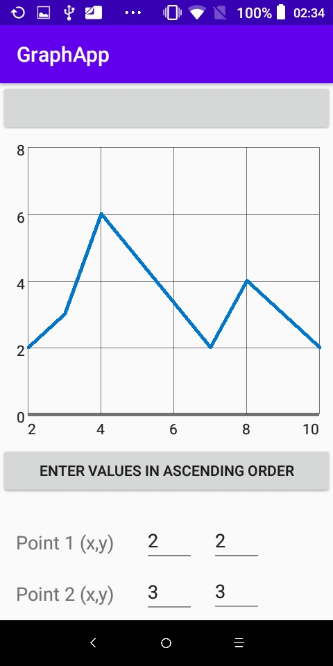

# Ploty
Ploty is an application that uses the [GraphView library](https://github.com/jjoe64/GraphView) to plot points and form a line graph.It allow the user to enter the values and plot the graph when they press the plot button.

# Contributions
Feedback and contributions are welcome.If you have any issues with the application please check out the issues tab and compare with other issues or post a new one.
